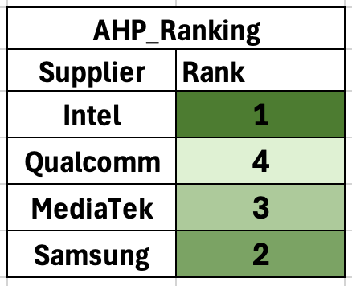

# Supplier Selection for Semiconductor Chips

## Description
This project aims to identify the best supplier for semiconductor chips from a list of four potential suppliers by evaluating them using two different multi-criteria decision-making methods: TOPSIS and AHP. The evaluation considers four specific attributes/criteria for each supplier.

## Goals
1. **TOPSIS Method**: Find the best supplier for semiconductor chips from the given 4 suppliers considering the 4 attributes/criteria using TOPSIS (Technique for Order Of Preference by Similarity to Ideal Solution) Method.
2. **AHP Method**: Find the best supplier for semiconductor chips from the given 4 suppliers considering the 4 attributes/criteria using the AHP (Analytic Hierarchy Process) Technique.

### TOPSIS Method
- **Result**: Based on the closeness to the ideal solution, Intel turns out to be the best supplier for the semiconductor chips using the TOPSIS method.

### AHP Method
- **Result**: Based on the total score of weighted preference values of each attribute, Intel turns out to be the best supplier for the semiconductor chips.

